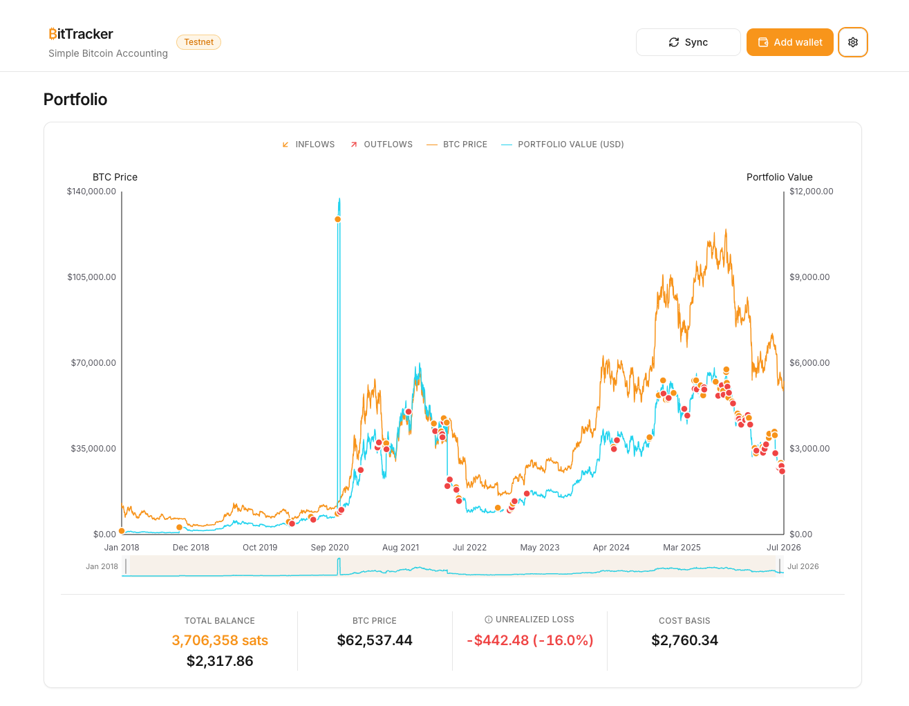
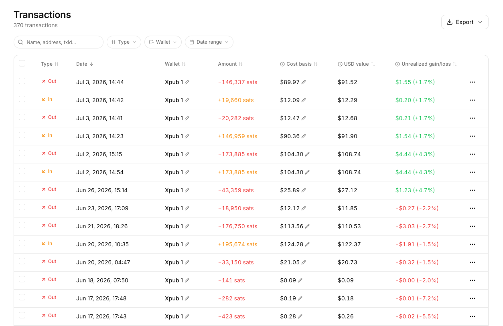
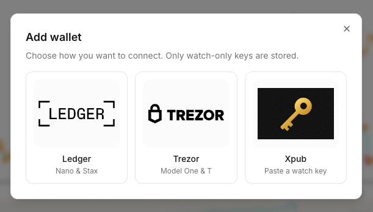
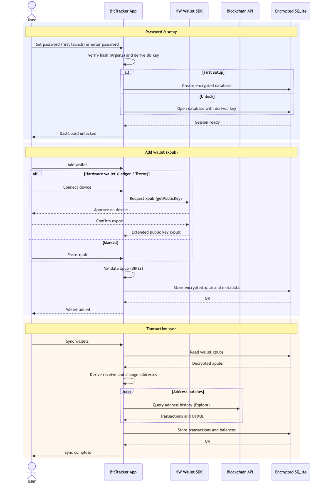

# BitTracker

Bitcoin accounting desktop app - Privacy first.







# Features

- Track multiple Hardware wallets (Ledger, Trezor & Xpub support)
- All data stored encrypted at rest on your device
- Sync uses BlockStream API over Tor (no ip-logging), custom Esplora API configurable

## Security & architecture



**Summary:** Portfolio data is encrypted at rest using user password (Argon2 + SQLCipher). Chain sync queries public Esplora APIs with derived addresses. Custom Bitcoin node configurable.

## Development

```bash
pnpm install
pnpm dev
```

`pnpm dev` runs the renderer on port 5173 and launches Electron with hot reload for the main process.

### Testnet Vs Mainnet

While developing, the app defaults to **Bitcoin testnet**:

Production builds (`pnpm start` / packaged app) use **mainnet** unless overridden.

Override explicitly:

```bash
# Force mainnet while running the dev stack
BITTRACK_NETWORK=mainnet pnpm dev

# Force testnet in a production-like run
BITTRACK_NETWORK=testnet pnpm start
```

Add wallets via **Add wallet → Enter xpub manually**. These public BIP84 test vectors (path `m/84'/1'/0'`) all have confirmed testnet transaction history — no faucet funding needed:

| Label               | xpub                                                                                                              | Notes                                                                                                                                                                                                                                     |
| ------------------- | ----------------------------------------------------------------------------------------------------------------- | ----------------------------------------------------------------------------------------------------------------------------------------------------------------------------------------------------------------------------------------- |
| BIP32 test vector 1 | `tpubDDNRbZGvdA33cgpY5uy2mmphT7sK4uciRjcQScSd64S5KRyZDxHcPuzs24or84Hywugb2JbEEt2jWH8fduiN9cmZzkSj8sSSx6txXkhXyZs` | [BIP32 test seed](https://github.com/bitcoin/bips/blob/master/bip-0032.mediawiki#test-vector-1-for-seed-000102030405060708090a0b0c0d0e0f). First receive address `tb1q7f0pjwhc3jzzv0w4uurm589506glv2dg2qy7ze` (~12 txs).                  |
| BIP39 “abandon…”    | `tpubDC8msFGeGuwnKG9Upg7DM2b4DaRqg3CUZa5g8v2SRQ6K4NSkxUgd7HsL2XVWbVm39yBA4LAxysQAm397zwQSQoQgewGiYZqrA9DsP4zbQ1M` | Mnemonic `abandon abandon abandon abandon abandon abandon abandon abandon abandon abandon abandon about`. First receive address `tb1q6rz28mcfaxtmd6v789l9rrlrusdprr9pqcpvkl` (~600 txs). Handy second wallet for multi-wallet UI testing. |
